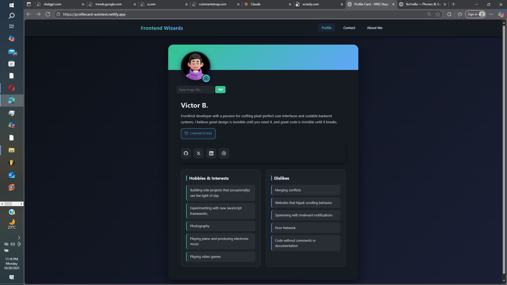
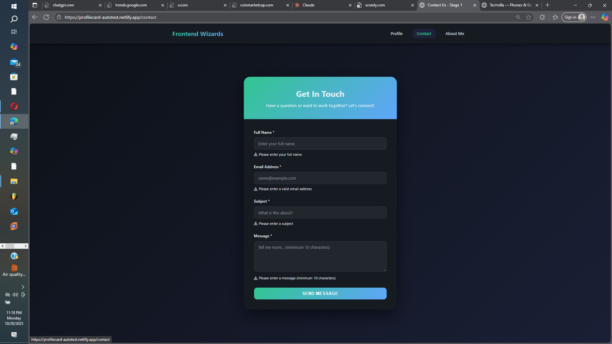
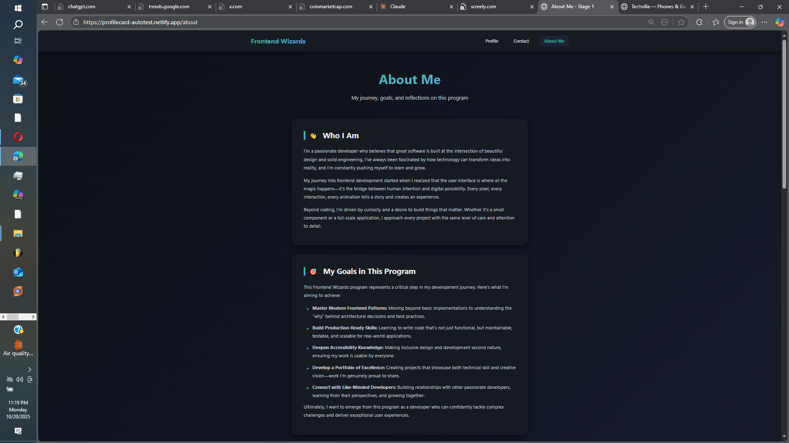

# 🎨 Testable Profile Card - HNG Stage 0

A modern, accessible, and fully responsive profile card component built with semantic HTML, CSS, and vanilla JavaScript. Features a stunning dark mode design with smooth animations and complete test coverage support.


## 🚀 Live Demo & Preview

**[View Live Demo →](https://profilecard-autotest.netlify.app)** 

### Profile Card


### Contact Form


### About Me

## 📄 Pages

This project consists of three pages:

1. **Profile Card (index.html)** - Stage 0: Interactive profile card with avatar upload
2. **Contact Us (contact.html)** - Stage 1: Form with validation and email integration
3. **About Me (about.html)** - Stage 1: Personal reflections and goals

## ✨ Features
### Stage 0 - Profile Card
- ✅ **Fully Testable** - All elements include `data-testid` attributes
- ✅ **Semantic HTML** - Proper use of `<article>`, `<figure>`, `<nav>`, `<section>`
- ✅ **Accessible** - ARIA labels, keyboard navigation, visible focus states
- ✅ **Responsive Design** - Mobile, tablet, and desktop optimized
- ✅ **Live Timestamp** - Real-time display of `Date.now()` in milliseconds
- ✅ **Avatar Upload** - Accept both URL images and file uploads
- ✅ **Social Links** - Properly secured external links

### Stage 1 - Contact Us
- ✅ **Form Validation** - Real-time and on-submit validation
- ✅ **Email Integration** - Connects to Formspree for actual email delivery
- ✅ **Accessible Forms** - Labels, ARIA associations, error messaging
- ✅ **Success Feedback** - Clear confirmation after submission
- ✅ **Keyboard Accessible** - Full navigation without mouse

### Stage 1 - About Me
- ✅ **Semantic Structure** - Proper heading hierarchy and sections
- ✅ **Personal Reflections** - Bio, goals, confidence areas, future note
- ✅ **Responsive Layout** - Beautiful on all screen sizes
- ✅ **Smooth Animations** - Staggered entrance effects

## 📋 Requirements Met
### Stage 0 Requirements
- [x] Profile card root container — `data-testid="test-profile-card"`
- [x] Name — `data-testid="test-user-name"`
- [x] Biography — `data-testid="test-user-bio"`
- [x] Current time (milliseconds) — `data-testid="test-user-time"`
- [x] Avatar image — `data-testid="test-user-avatar"`
- [x] Social links list — `data-testid="test-user-social-links"`
- [x] Individual social links — `data-testid="test-user-social-<network>"`
- [x] Hobbies list — `data-testid="test-user-hobbies"`
- [x] Dislikes list — `data-testid="test-user-dislikes"`

### Stage 1 - Contact Us Requirements
- [x] Full name — `test-contact-name`
- [x] Email — `test-contact-email`
- [x] Subject — `test-contact-subject`
- [x] Message — `test-contact-message`
- [x] Submit button — `test-contact-submit`
- [x] Error messages — `test-contact-error-<field>`
- [x] Success message — `test-contact-success`
- [x] All fields required with validation
- [x] Email validation
- [x] Message minimum 10 characters
- [x] Labels linked with `for` attribute
- [x] Error messages tied with `aria-describedby`
- [x] Fully keyboard accessible

### Stage 1 - About Me Requirements
- [x] Main wrapper — `test-about-page`
- [x] Bio — `test-about-bio`
- [x] Goals — `test-about-goals`
- [x] Confidence areas — `test-about-confidence`
- [x] Future note — `test-about-future-note`
- [x] Extra thoughts — `test-about-extra`
- [x] Semantic HTML with proper sections
- [x] Proper heading hierarchy


## 🛠️ Tech Stack

- **HTML5** - Semantic markup
- **CSS3** - Custom properties, Flexbox, Grid, animations
- **Vanilla JavaScript** - No frameworks or dependencies
- **Formspree** - Email service integration (Contact form)
- **FileReader API** - For avatar image uploads

## 📦 Installation & Setup

### Quick Start
1. Download all three HTML files:
   - `index.html` (Profile Card)
   - `contact.html` (Contact Us)
   - `about.html` (About Me)

2. **Set up Formspree for Contact form:**
   - Go to [https://formspree.io/](https://formspree.io/)
   - Sign up for free
   - Create a new form
   - Copy your form ID
   - In `contact.html`, replace `YOUR_FORM_ID` on line 12:
     ```html
     <form ... action="https://formspree.io/f/YOUR_FORM_ID" ...>
     ```

3. Open `index.html` in any modern browser

### Option 2: Local Development
```bash
# Clone the repository
git clone https://github.com/victorbjay/profile-card-stage0.git

# Navigate to project directory
cd profile-card-stage0

# Open with your preferred local server
# Using Python 3:
python -m http.server 8000

# Using Node.js (http-server):
npx http-server

# Using VS Code Live Server:
# Right-click index.html → "Open with Live Server"
```

Then visit `http://localhost:8000` in your browser.

## 🚢 Deployment

### Deploy to Netlify
1. Drag and drop `index.html` to [Netlify Drop](https://app.netlify.com/drop)
2. Or connect your GitHub repo for continuous deployment

### Deploy to GitHub Pages
```bash
# Push to GitHub
git add .
git commit -m "Initial commit"
git push origin main

# Enable GitHub Pages
# Go to Settings → Pages → Source: main branch
```
## 🧪 Testing

All elements are tagged with `data-testid` attributes for automated testing.

### Stage 0 - Profile Card Tests
```javascript
// Profile card elements
const card = screen.getByTestId('test-profile-card');
const name = screen.getByTestId('test-user-name');
const bio = screen.getByTestId('test-user-bio');
const time = screen.getByTestId('test-user-time');
const avatar = screen.getByTestId('test-user-avatar');
const socialLinks = screen.getByTestId('test-user-social-links');
const hobbies = screen.getByTestId('test-user-hobbies');
const dislikes = screen.getByTestId('test-user-dislikes');
```

### Stage 1 - Contact Form Tests
```javascript
// Contact form elements
const nameInput = screen.getByTestId('test-contact-name');
const emailInput = screen.getByTestId('test-contact-email');
const subjectInput = screen.getByTestId('test-contact-subject');
const messageInput = screen.getByTestId('test-contact-message');
const submitBtn = screen.getByTestId('test-contact-submit');
const successMsg = screen.getByTestId('test-contact-success');

// Error messages
const nameError = screen.getByTestId('test-contact-error-name');
const emailError = screen.getByTestId('test-contact-error-email');
```

### Stage 1 - About Page Tests
```javascript
// About page sections
const aboutPage = screen.getByTestId('test-about-page');
const bio = screen.getByTestId('test-about-bio');
const goals = screen.getByTestId('test-about-goals');
const confidence = screen.getByTestId('test-about-confidence');
const futureNote = screen.getByTestId('test-about-future-note');
const extra = screen.getByTestId('test-about-extra');
```

## 🎨 Customization
### Change Colors
Edit the CSS custom properties in the `:root` selector if you want:
```css
:root {
    --primary: #6366f1;        /* Primary accent color */
    --secondary: #ec4899;      /* Secondary accent color */
    --bg-dark: #0f172a;        /* Background color */
    --bg-card: #1e293b;        /* Card background */
    /* ... etc */
}
```
### OR set theme in the script file 
```js
document.documentElement.classList.add("theme-forest");
// To switch themes, change the class above to 'theme-sunny' or 'theme-forest'
```
### Change Avatar
- **URL**: Replace the `src` attribute in the `` tag
- **Upload**: Click the camera button/icon or avatar image to upload your own

### Update Content
Simply edit the HTML content within the appropriate `data-testid` elements:
- Name: Edit text in `<h2 data-testid="test-user-name">`
- Bio: Edit text in `<p data-testid="test-user-bio">`
- Hobbies/Dislikes: Edit `<li>` items in respective lists

## 📱 Browser Support

- ✅ Chrome/Edge (latest)
- ✅ Firefox (latest)
- ✅ Safari (latest)
- ✅ Mobile browsers (iOS Safari, Chrome Mobile)

## ♿ Accessibility Features

- Semantic HTML structure
- ARIA labels for all interactive elements
- Keyboard navigation with visible focus states
- Alt text for images
- Reduced motion support for users with vestibular disorders
- High contrast color scheme
- Touch-friendly tap targets (48x48px minimum)
- Form error associations with `aria-describedby`
- Proper label-input relationships

## 🔧 Setup Checklist

Before deploying, make sure you:

- [ ] Replace `YOUR_FORM_ID` in `contact.html` with your actual Formspree form ID
- [ ] Update the profile information in `index.html` with your own details
- [ ] Personalize the About Me content in `about.html`
- [ ] Update avatar image URL or upload your own photo
- [ ] Test all three pages locally
- [ ] Verify all form validations work
- [ ] Test on mobile devices
- [ ] Check keyboard navigation
- [ ] Deploy to your hosting service
- [ ] Update README with your live URL
- [ ] Submit before deadline (October 22, 2025)

## 🎓 Learning Outcomes

### Stage 0
- Semantic HTML structure
- CSS Grid and Flexbox layouts
- JavaScript date manipulation
- File handling with FileReader API
- Responsive design principles
- Accessibility best practices

### Stage 1
- HTML form validation
- Client-side and server-side integration
- Error handling and user feedback
- ARIA associations for forms
- Multi-page navigation
- Content organization and hierarchy

## 📝 Validation Rules

### Contact Form
1. **Full Name**: Required, cannot be empty
2. **Email**: Required, must be valid format (name@example.com)
3. **Subject**: Required, cannot be empty
4. **Message**: Required, minimum 10 characters

### Form Behavior
- Real-time validation on blur
- Error messages appear immediately
- Errors clear as user types valid input
- Success message shows after successful submission
- Form resets after successful submission
- Focus moves to first invalid field on error

## 🌟 Best Practices Implemented

### HTML
- Semantic elements (`<article>`, `<section>`, `<nav>`, `<main>`)
- Proper heading hierarchy (h1 → h2 → h3)
- Form labels linked with `for` attribute
- ARIA attributes for accessibility
- Alt text for all images

### CSS
- CSS custom properties (variables)
- Mobile-first responsive design
- Smooth transitions and animations
- Reduced motion support
- Consistent spacing and typography
- Dark mode optimized colors

### JavaScript
- Event delegation where appropriate
- Input validation functions
- Error handling
- Fetch API for form submission
- Clean, readable code structure
- Comments for clarity
## 📚 Resources Used

- [MDN Web Docs - Semantic HTML](https://developer.mozilla.org/en-US/docs/Web/HTML/Element)
- [MDN - Form Validation](https://developer.mozilla.org/en-US/docs/Learn/Forms/Form_validation)
- [W3C - Web Accessibility](https://www.w3.org/WAI/tutorials/forms/)
- [CSS-Tricks - Media Queries](https://css-tricks.com/snippets/css/media-queries-for-standard-devices/)
- [Formspree Documentation](https://help.formspree.io/)

## 🎯 Stage Completion

### Stage 0 ✅
- [x] Profile Card with all required elements
- [x] All data-testids implemented
- [x] Semantic HTML structure
- [x] Fully responsive
- [x] Avatar upload functionality
- [x] Live timestamp
- [x] Social links
- [x] Accessible

### Stage 1 ✅
- [x] Contact Us page with validation
- [x] Email integration with Formspree
- [x] About Me page with reflections
- [x] All required data-testids
- [x] Form accessibility
- [x] Success/error messaging
- [x] Multi-page navigation
- [x] Consistent design across pages

### Submission Links
- **Stage 0**: [Stage 0 Submission Form](https://forms.gle/p7PcQ8nqVeH7rVcs9)
- **Stage 1**: [Stage 1 Submission Form](https://forms.gle/J65RPCVspzJJDGNP7)

### Deadlines
- **Stage 0**: October 19, 2025 ✅
- **Stage 1**: October 22, 2025 ⏰

---

Made with 💜 for Frontend Wizards